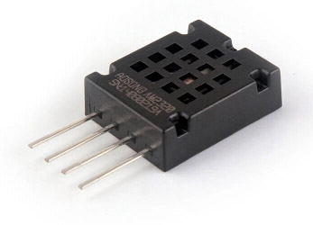

# MicroPython AM2320 I2C

A MicroPython library for interfacing with an [Aosong AM2320](http://www.aosong.com/cn/products/details.asp?id=152) temperature and humidity sensor over I2C.

This library focuses on using the I2C interface. The sensor also supports a 1-wire interface, available when pin 4 is connected to GND.



#### Examples

Basic measurement

```python
import am2320
from machine import I2C, Pin
i2c = I2C(scl=Pin(5), sda=Pin(4))
sensor = am2320.AM2320(i2c)
sensor.measure()
print(sensor.temperature())
print(sensor.humidity())
```

Continuous measurement

```python
import time
import am2320
from machine import I2C, Pin
i2c = I2C(scl=Pin(5), sda=Pin(4))
sensor = am2320.AM2320(i2c)

while True:
	sensor.measure()
	print(sensor.temperature())
	print(sensor.humidity())
	time.sleep_ms(4000)
```

For full documentation see http://micropython-am2320.rtfd.io/.

## License

Licensed under the [MIT License](http://opensource.org/licenses/MIT).
