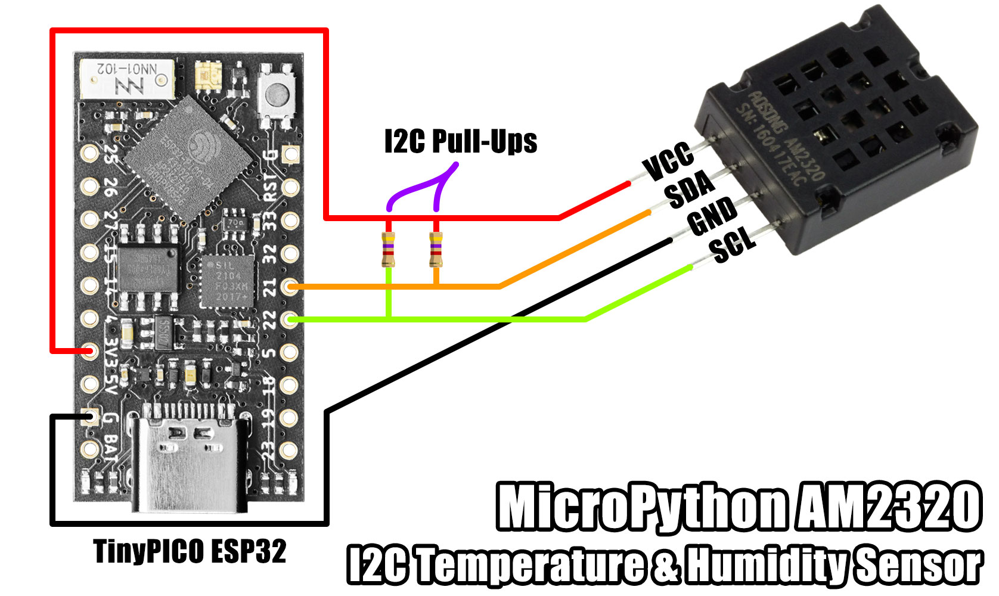

# MicroPython AM2320 I2C

A MicroPython library for interfacing with an [Aosong AM2320](http://www.aosong.com/en/products-41.html) temperature and humidity sensor over I2C.

This library focuses on using the I2C interface. The sensor also supports a 1-wire interface, available when pin 4 is connected to GND.




## Installation

Using mip via mpremote:

```bash
$ mpremote mip install github:mcauser/micropython-am2320
$ mpremote mip install github:mcauser/micropython-am2320/examples
```

Using mip directly on a WiFi capable board:

```python
>>> import mip
>>> mip.install("github:mcauser/micropython-am2320")
>>> mip.install("github:mcauser/micropython-am2320/examples")
```

Manual installation:

Copy `src/am2320.py` to the root directory of your device.


## Examples

**Basic usage**

```python
from machine import I2C, Pin
import am2320

i2c = I2C(0)
sensor = am2320.AM2320(i2c)

sensor.measure()
print(sensor.temperature())
print(sensor.humidity())
```


## Methods

### __init__(i2c)

As with other modern Aosong sensors, this sensor supports an I2C interface and can be found at address 0x5C.

### check()

Scans the I2C bus looking for the sensor at it's fixed I2C address 0x5C. Raises a OSError if not found.

### measure()

Reads the temperature and humidity from the sensor over the I2C bus and persists for subsequent calls to `temperature()` and `humidity()`.
Received bytes contains a checksum to ensure the data is error free, otherwise an exception is raised.

### temperature()

Returns the temperature in degrees Celsius from the data collected from the last `measure()` call.

### humidity()

Get the relative humidity as a percentage from the data collected from the last `measure()` call.

### _wake()

The sensor goes into sleep mode when idle to help minimise influencing the readings and requires writing a byte to wake it back up.
The write will fail, however the sensor interprets it as a wake up call.

### _crc16(buf)

A 16-bit cyclic redundancy check for verifying the received data is error free.


## Parts

* [AM2320](https://s.click.aliexpress.com/e/_DCcOdjL)
* [AM2320](https://s.click.aliexpress.com/e/_DeLEjAD)
* [TinyPICO](https://www.tinypico.com/)
* [WeMos D1 Mini](https://www.aliexpress.com/item/32529101036.html)


## Connections

AM2320 | TinyPICO (ESP32)
------ | ----------------
VIN    | 3V3
SDA    | 22
GND    | GND
SCL    | 21

AM2320 | Wemos D1 Mini (ESP8266)
------ | -----------------------
VIN    | 3V3
SDA    | GPIO4
GND    | GND
SCL    | GPIO5


## Links

* [micropython.org](http://micropython.org)
* [AM2320 datasheet](docs/AM2320.pdf)
* [TinyPICO Getting Started](https://www.tinypico.com/gettingstarted)


## License

Licensed under the [MIT License](http://opensource.org/licenses/MIT).

Copyright (c) 2016 Mike Causer
